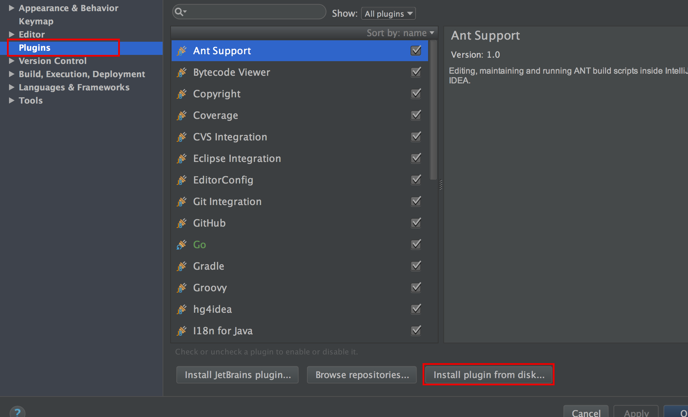
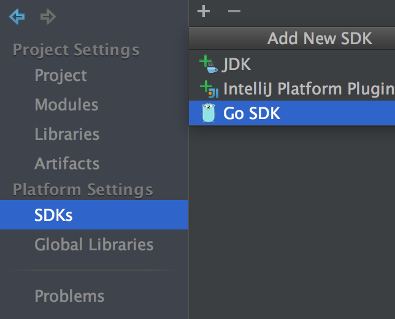
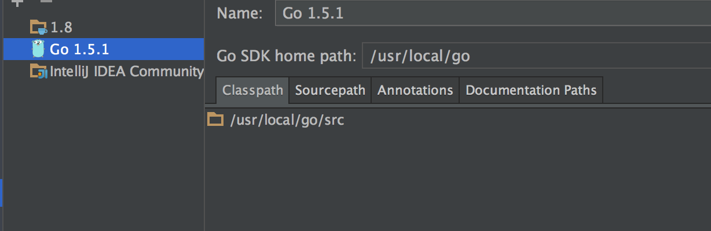
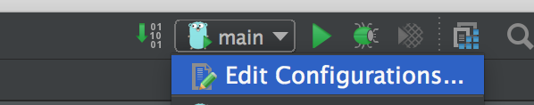
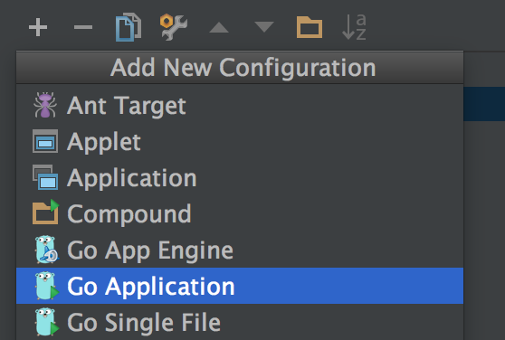
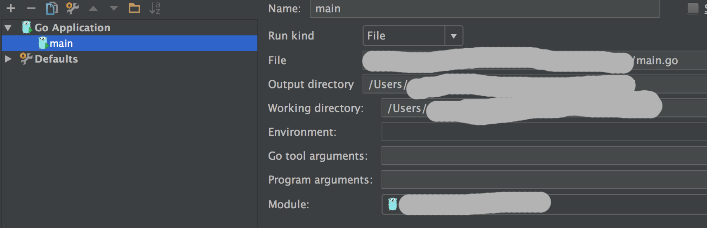

看到一篇文章说IntelliJ IDEA开发作为Go的开发环境不错，突然发神经地想试了一下。
谁知道跟着教程走，到后面越来越不对劲，去百度其它教程，谁知道千篇一律。。。

好了下面开始了

1. 首先把`GO`安装好。。。（自行安装，附上一篇我之前写的[MAC安装GO](http://skytoup.wicp.net/2015/10/03/MacOs%E4%B8%8B%E5%AE%89%E8%A3%85go-lang/)）
2. 安装`IntelliJ IDEA`，下载地址: <https://www.jetbrains.com/idea/download/>。
3. 下载`go-lang-idea-plugin`这个插件，下载地址: <https://plugins.jetbrains.com/plugin/5047>。(PS:网上百度的基本都是下源码、编译，搞了一个下午编译，谁知道有已经编译好的可以下载)
4. 下载之后，是一个zip文件，不需要解压，打开IntelliJ IDEA，打开`Preferences->Plugins`，点击`Install plugin from disk...`，选择刚下载的zip文件，然后重启一下，插件就这样安装好了。

  
5. 打开`File->Project Structure...`，找不到的随便打开一个项目就能看到。点击`SDKS`，新建一个`GO SDK`，填上`GO`的安装目录。

使用:随便新建一个Go项目，点击`Edit Configurations...`，新建一个`Go Application`，右边`File`你的`pack main`包含`func main`的文件，`Output directory`为编译后的文件输出目录。新建完毕后，选择新建的Debug选项就可以编译、运行程序了。

接下来来点IntelliJ IDEA的快捷键吧(我的是Mac OSX) :

1. CMD+Shift+O    查找跳转文件
2. CMD+Shift+L    代码对齐
3. CMD+Shift+Alt+F    go fmt 一个文件
4. CMD+Shift+Alt+P    go fmt整个项目
5. CMD+Alt+O    自动import
6. CMD+F12    显示当前文件的结构
7. 按住CMD点击结构体可以源码跳转
8. CMD+P    显示函数参数
9. CMD+E    显示最近编辑文件
10. Alt+Enter    自动修复错误
11. Shift+F6    重构