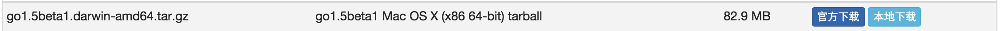
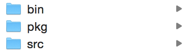
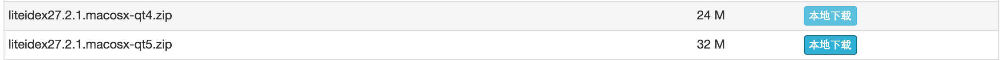

## 1.下载安装包
> 由于官网被墙了，所以到国内的一个go论坛下载:[点击进入下载](http://golangtc.com/download)

下载后，双击进行安装。

## 2.配置环境变量
> $GOROOT:go lang 安装目录	
  $GOPATH:go lang 工作目录，有点像Eclipse那样子	

下面开始配置
到终端输入以下命令:
```shell
vim ~/.bash_profile # 打开环境变量配置
```

在最下面添加
```shell
export GOPATH=/Users/(用户名/路径) # 改成你喜欢的路径
export GOROOT=/usr/local/go # 默认安装都市这个路径
```

添加完毕后，退出vim
到终端输入以下命令:
```shell
source ~/.bash_profile # 让环境变量配置生效
```

完成后，到$GOPATH的目录下，新建三个文件夹

		
	bin:存放编译后的可执行文件;
	pkg:存放编译后的包文件;
	src:存放项目源文件;

最后，到终端输入以下命令验证时候安装成功:
```shell
go version
```

出现类似图中则为成功，若不成功，请检测一下你的环境变量配置。

## 3.IDE
> 一.Sublime Text(个人比较喜欢)
安装好SublimeText后，再安装插件管理器，到插件管理器安装处，输入GoSublime，回车安装
安装完成后，还要安装一个语法提示插件:
到终端输入一下命令:
```shell
go get github.com/nsf/gocode
go install github.com/nsf/gocode
```

> 二.LiteIDE
下载地址:[LiteIDE](http://www.golangtc.com/download/liteide)
>>
  下载其中一个即可
  解压即可用

> 三.Wide
项目地址:[Wide项目](https://github.com/b3log/wide)	
官网地址:[官网][wide]
下载后，使用go来运行，在浏览器打开指定的ip和端口即可使用(详情请参考[官网][wide])
[wide]:	https://wide.b3log.org/login	"wide"

## 4.学习Go lang
- 官方教程:[免翻墙](http://tour.studygolang.com/welcome/1)
- Go语言中文网:[Go语言中文网](http://studygolang.com/)
- GoLang中国:[GoLang中国](http://www.golangtc.com/)