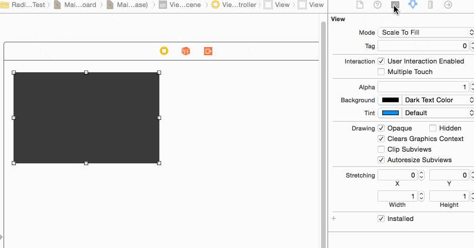

UIView背景色的四个边角自定义成圆角

比较简单，没什么好介绍的

GitHub链接：<https://github.com/skytoup/SkyRadiusView>

测试环境：Xcode 6，iOS 7.0以上 
- [ ] https://img-blog.csdn.net/20150812072718059https://img-blog.csdn.net/20150812072718059

	pod 'SkyRaduisView', '~> 1.0.0'

