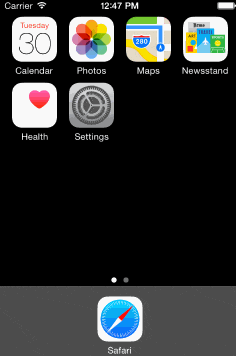

# SkyWaitingView（[github链接](https://github.com/skytoup/SkyWaitingView)）
-----
## 测试环境：Xcode 6，iOS 7.0以上。

## 简介
一个简单的等待指示器

* 可自定义圆弧粗细、颜色、旋转速率
* 可自定义标签显示

-----
## 使用方法
把头文件 `SkyWaitingView.h` 导入项目，然后设置各属性，具体使用方法请参考示例项目。

```objc
SkyCircleWatingView *v = [SkyCircleWatingView new];
v.frame = CGRectMake(50, baseY, 0, 0);
[v sizeToFit];
[self.view addSubview:v];
v.rate = 1.f;
[v start];
```

-----
## 联系方式
* QQ：875766917，请备注
* QQMail：875766917@qq.com