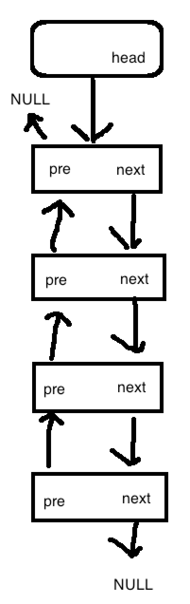
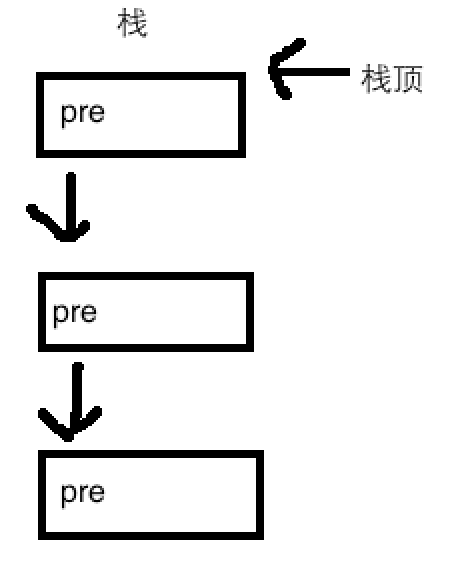

# 1.链表基础

链表是一段非连续物理地址的存储结构，通过节点的成员变量，存储其它单元格的地址，构成一条链，称为链表。

`链表的结构如下图（画得不是很好）：`


这是一个双向链表，可以通过每一个节点，找到它的上一个节点，或者下一个节点。
如果为单向链表，则节点没有pre这个成员变量。

节点的结构体定义：

```c
struct link_node {
    struct link_node *next; // 前一个节点
    struct link_node *pre; // 后一个节点
    void *val; // 节点值
};
```

一般来说，都会有一个存储链表头节点的结构体，如上图的第一个圆角矩形。

可以新建一个结构体来存储链表首节点，或者新建一个不存储数值的节点来存储首节点。

# 2.优缺点

- 动态创建节点来存储数据
- 插入节点快
- 读取指定位置节点慢
- 结构较简单

# 3.扩展

- 栈
- 循环链表
- 队列（双向队列、单向队列）
- 树、图、链地址法的哈希表 结构的基础
- 。。。。。。（还有很多吧）

