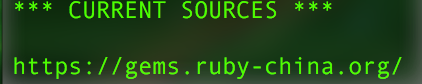

> 2016-06-01
> 修改安装的第四个命令多写了一个'o'

# CocoaPods简介
> `CocoaPods`是一个管理`Swift`和`Objective-C`的`Cocoa`项目的依赖工具。它现在有超过一万八千多个库，可以优雅地帮助你扩展你的项目。简单的说，就是替你管理`Swift`和`Objective-C`的Cocoa项目的第三方库引入。

> 官网地址: <https://cocoapods.org/>

# 安装
1. Mac上面本来就自带了ruby，所有就不用自己安装了(除非你卸载了)。
2. 打开`Terminal`(终端)，输入以下命令(第二个命令可能会需要稍等一会儿)
		
		gem sources --remove https://rubygems.org/
		gem source -a https://gems.ruby-china.org

3. 第一个命令是移除官方源，因为在不翻墙的情况下，使用起来比较慢；第二个命令是添加`ruby-china`的`RubyGems`镜像(很多旧教程都是说使用taobao的gem源，但是taobao的gem源已经停止维护了，原文: <https://ruby-china.org/topics/29250>)。
	
	接下来运行一个命令查看是否成功添加了`ruby-china`的`gem`源:
	
		gem source
		
	出现下图这样子，则代表成功添加~
	
		
3. 然后就可以开始真正安装`CocoaPods`了，输入一下命令:
	
		sudo gem install cocoapods
		
	等一会儿就能安装完成~~~
	
4. 安装结束后，需要运行一下命令初始化`CocoaPods`: 
	
		pod setup
		
	没有什么错误的话，就算了安装结束了。
	
# 基本使用
1. 打开`Terminal`(终端)，`cd`到你的Project目录，输入一下命令:
	
		pod init

	运行结束后，该目录下，会生成了一个`Podfile`文件
	
2. 使用文本编辑器(vim、Sublime Text2、等等...)打开它(`Podfile`)，大概会看到以下的东西

		platform :ios, 'xxx' # 目标平台及其版本
		use_frameworks! # swift项目需要这句话，是Objective-C项目的话，请在前面加个`#`注释掉
		target 'xxxx' do
			# 在这里添加你的依赖库说明，如pod xxx
			pod 'Alamofire', '~> 3.1’ # 例如这是引入Alamofire这个第三方库
		end
	
3. 编辑完`Podfile`后，使用`Terminal`(终端)输入其中一个命令(需要cd到项目的根目录，即`Podfile`所在目录): 
		
		pod install --no-repo-update
		or
		pod install
		
	第一个命令是不更新本地库信息进行安装，速度会快一点，毕竟不需要更新。但是会有一点点问题，当有一个新的库发布的时候，就会无法安装成功。如果不嫌麻烦，可以定时执行以下命令更新`CocoaPods`的库，然后就可以在一段时间使用以上的第一个命令进行安装:

		pod repo update
	
4. 安装完成之后，打开项目就需要打开`xxx.xcworkspace`，而不是`xxx.xcodeproj`了
5. 如果在安装之后，修改了`Podfile`文件，可以执行以下的其中一个命令进行库的更新(两个命令的区别和上面说的一样):
	
		pod update --no-repo-update
		or
		pod update

# 安装CocoaPods的可能失败原因
gem过旧，使用以下命令更新一下，再进行安装(先切换到了`ruby-china`的`gem`源再运行一下命令更新):

		sudo gem update