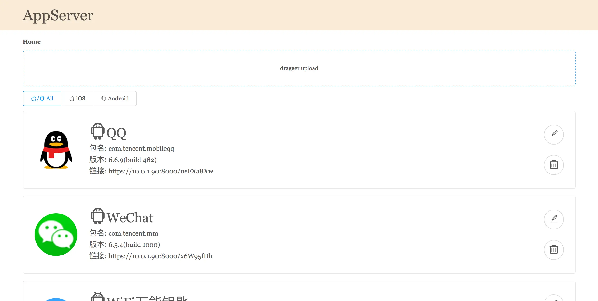
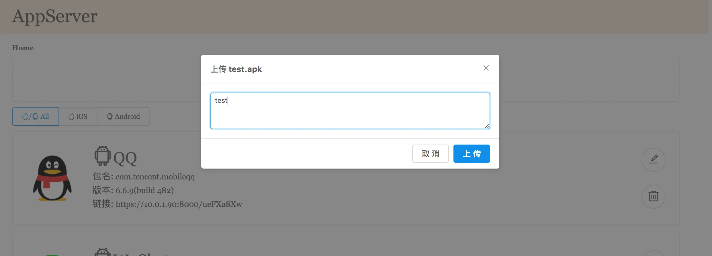
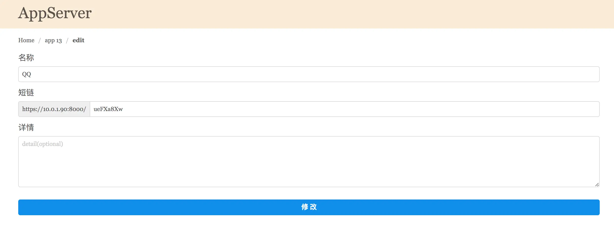

## 废话
平时都在使用`fir`, 但是公司网速有时候很蛋疼, 安装包体积一大, 就安装个10多分钟都搞不定。而且`fir`开始有点点收费了, 所以干脆自己做一个简单的工具。断断续续地做了一个月, 终于完成了一些基本功能。

## 效果图
**首页**

**上传App**

**App详情页**

**App编辑页**

	
## 基本思路
1. 上传安装包, 然后区分`apk`和`ipa`安装包来进行解析, 获取各种包信息, 最后存到数据库
2. `apk`可以直接下载点击安装, `ipa`则需要一个plist文件来在线安装(详情请参考: <http://help.apple.com/deployment/ios/#/apda0e3426d7>)
3. 省略各种增删改查......

## 使用技术
### 服务端
- 使用`python`3.5以上的版本
- 选择了一个比较新的框架👉[Sanic](https://github.com/channelcat/sanic)
- 数据库简单使用了`sqlite3`, ORM使用了[sqlalchemy](https://github.com/zzzeek/sqlalchemy)

**源码传送门** 👉 [AppServer](https://github.com/skytoup/AppServer)

### 前端(基本没做过, 很简陋)
- 直接选用了`React`
- 看到[dva](https://github.com/dvajs/dva)这个`React`框架比较简单, 就选了这个
- 在`dva`哪里看到[antd](https://github.com/ant-design/ant-design)这个UI框架, 感觉还不错

**源码传送门** 👉 [AppServerHTML](https://github.com/skytoup/AppServerHTML)

	喜欢的就给两个start吧😁
	
