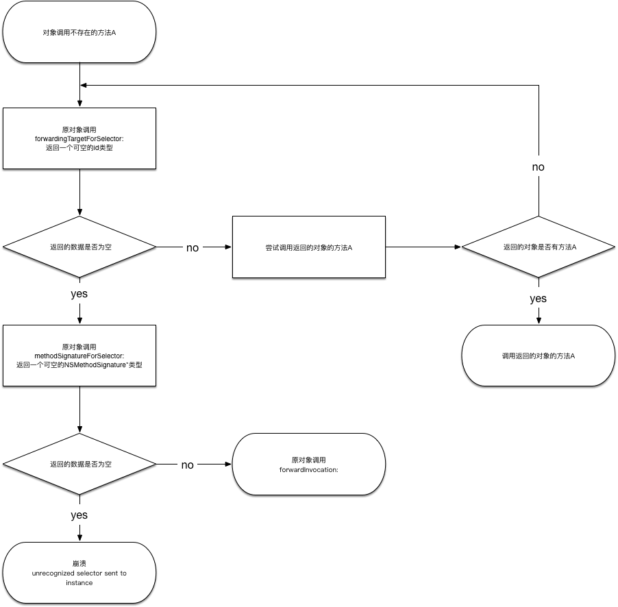

# 概(fei)述(hua)
...(省略1024亿个byte)

# 探究
为了研究`Objective-C`的消息转发，做了一系列测试

## Test 0
- 内容: 调用对象存的方法
- 步骤: 
	1. 定义一个`TestObject`类，继承`NSObject`, 重写的方法如下:

		```objc
		@implementation TestObject
		
		+ (BOOL)resolveClassMethod:(SEL)sel {
		    BOOL ret = [super resolveClassMethod:sel];
		    NSLog(@"-->> %@ %p resolveClassMethod: %@, return: %d", [self class], self, NSStringFromSelector(sel), ret);
		    return ret;
		}
		
		- (BOOL)respondsToSelector:(SEL)aSelector {
		    BOOL ret = [super respondsToSelector:aSelector];
		    NSLog(@"-->> %@ %p respondsToSelector: %@, return: %d", [self class], self, NSStringFromSelector(aSelector), ret);
		    return ret;
		}
		
		- (id)forwardingTargetForSelector:(SEL)aSelector {
		    id ret = [super forwardingTargetForSelector:aSelector];
		    NSLog(@"-->> %@ %p forwardingTargetForSelector: %@, return: %@", [self class], self, NSStringFromSelector(aSelector), ret);
		    return ret;
		}
		
		- (NSMethodSignature *)methodSignatureForSelector:(SEL)aSelector {
		    NSMethodSignature* ret = [super methodSignatureForSelector:aSelector];
		    NSLog(@"-->> %@ %p methodSignatureForSelector: %@, return: %@", [self class], self, NSStringFromSelector(aSelector), ret);
		    return ret;
		}
		
		- (void)forwardInvocation:(NSInvocation *)anInvocation {
		    NSLog(@"-->> %@ %p forwardInvocation: %@", [self class], self, anInvocation);
		    [super forwardInvocation:anInvocation];
		}
		
		@end
	```
	
	2. 代码

		```objc
		[[TestObject alloc] init];
		```
		
- 结果: 什么都没有log	
- 结论: 调用存在的方法, 没有发生任何消息转发

## Test 1
- 内容: 调用对象不存在的方法
- 步骤:
	1. 代码

		```objc
		TestObject* obj = [[TestObject alloc] init];
	   [obj performSelector:NSSelectorFromString(@"not exists sel")];
		```
		
- 结果: `TestObject`调用了`forwardingTargetForSelector:`(返回nil), 然后调用`methodSignatureForSelector:`(返回nil), 最后log `unrecognized selector sent to instance`
- 结论: 调用不存在的方法, 发生了消息转发

## Test 2
- 内容: `TestObject_1`重写`forwardingTargetForSelector:`(返回`TestObject`对象), 调用它们都不存在的方法
- 步骤: 
	1. 定义`TestObject_1`, 继承`TestObject`

	```objc
	@implementation TestObject_1

	- (id)forwardingTargetForSelector:(SEL)aSelector {
	    id ret = [[TestObject alloc] init];
	    NSLog(@"-->> %@ %p forwardingTargetForSelector: %@, return: %@", [self class], self, NSStringFromSelector(aSelector), ret);
	    return ret;
	}
	
	@end
	```
	
	2. 代码:

	```objc
	TestObject_2* obj = [[TestObject_2 alloc] init];
   [obj performSelector:NSSelectorFromString(@"not exists sel")];
	```
	
- 结果: `TestObject_1`对象先调用了`forwardingTargetForSelector:`(返回TestObject对象), 然后`TestObject`对象调用`forwardingTargetForSelector:`(返回nil), 跟着调用`methodSignatureForSelector:`(返回nil), 最后log `unrecognized selector sent to instance`
- 结论: 不存在的方法转发到了其它对象处理失败

## Test 3
- 内容: `TestObject_2`重写`forwardingTargetForSelector:`(返回`TestObject_1`), 调用`TestObject_2`不存在, 但`TestObject_1`存在的方法
- 步骤:
	1. 定义`TestObject_2`, 继承`TestObject`

	```objc
	@implementation TestObject_2

	- (id)forwardingTargetForSelector:(SEL)aSelector {
	    id ret = [[TestObject_1 alloc] init];
	    NSLog(@"-->> %@ %p forwardingTargetForSelector: %@, return: %@", [self class], self, NSStringFromSelector(aSelector), ret);
	    return ret;
	}
	
	@end
	```
	
	2. TestObject_1, 添加方法

	```objc
	- (void)testObject_1ExistsMethod {
   		NSLog(@"-->> %@ %p I am exists", [self class], self);
}
	```
	
	3. 代码

	```objc
	TestObject_2* obj = [[TestObject_2 alloc] init];
   [obj performSelector:NSSelectorFromString(@"testObject_1ExistsMethod")];
	```
	
- 结果: `TestObject_2`对象先调用了`forwardingTargetForSelector:`(返回TestObject_1对象), 然后`TestObject_1`对象调用了`testObject_1ExistsMethod`
- 结论: 不存在的方法转发到了其它对象处理成功

## Test 4
- 内容: `TestObject_3`重写`methodSignatureForSelector:`(不返回nil)和`forwardInvocation:`, 调用不存在的方法
- 步骤: 
	1. 定义`TestObject_3`, 继承`TestObject`
	
	```objc
	@implementation TestObject_3

	- (NSMethodSignature *)methodSignatureForSelector:(SEL)aSelector {
	    NSLog(@"-->> %@ %p methodSignatureForSelector: %@", [self class], self, NSStringFromSelector(aSelector));
	    return [NSObject methodSignatureForSelector:@selector(init)];
	}
	
	- (void)forwardInvocation:(NSInvocation *)anInvocation {
	    NSLog(@"-->> %@ %p forwardInvocation: %@", [self class], self, anInvocation);
	//    [super forwardInvocation:anInvocation]; // will crash, because the method signature is not right
	}
	
	@end
	```
	
	2. 代码

	```objc
	TestObject_3* obj = [[TestObject_3 alloc] init];
   [obj performSelector:NSSelectorFromString(@"not exists sel")];
	```
	
- 结果: 先调用了`forwardingTargetForSelector:`, 然后`methodSignatureForSelector:`, 最后`forwardInvocation:`, 没发生崩溃
- 结论: `TestObject_3`自己处理了不存在方法

# 总结
如下图


# 测试代码
TestMessageForwarding: <https://github.com/skytoup/TestMessageForwarding>