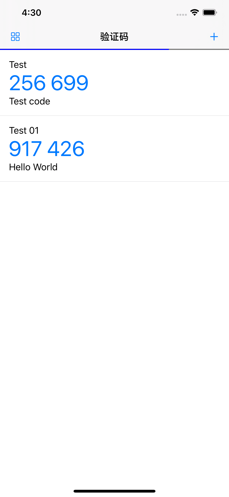
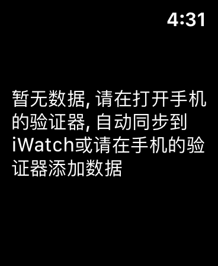

> GoogleAuthenticator TOTP部分实现的验证器(没有实现HOTP)
> 
> 已上架AppStore, 可直接下载体验: <itms-apps://itunes.apple.com/app/id1509275023>

由于GoogleAuthenticator没有导出功能, 而且在watch上也没有查看功能, 干脆自己实现一个

纯Swift5.x实现, 操作体验良好, 界面极简

另外增加相册二维码导入、二维码导出、watchOS同步查看

详情请到: <https://github.com/skytoup/Authenticator>

#### 部分截图

