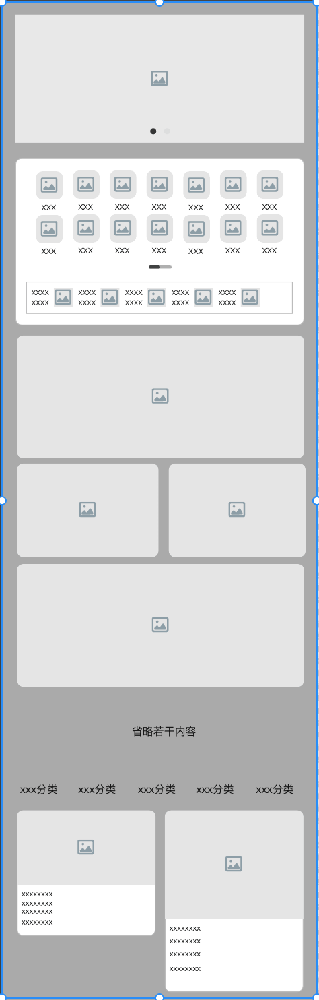

> 不涉及逆向相关内容, 仅做分析功能
>
> 仅作为技术研究, 如有侵权, 请及时联系删除

### 基本结构

首页大概的样子

- 广告栏
- 分类
- 各种活动...
- 分类 + 瀑布流列表

看到这样的首页, 首先想的是用`CollectionView`实现, 实现起来也挺困难的, 多个`section`, 布局也各不同。

但是这个首页用的是`TableView`实现, 单个`section`, 各种不一样布局的Cell。

总体操作流畅, 高速滑动有一点点掉帧(底下的瀑布流列表有圆角离屏渲染)。这么复杂的布局, 能有这样的体验, 挺不错的。

### 基本实现分析

`TableView`的数据管理抽离了`DataSource`类, 实现`UITableViewDataSource`和`UITableViewDelegate`, 还负责加载和管理数据(或许还有其它功能, 暂时没有太关注)

网络数据到cell的过程

1. `DataSource`获取网络数据
2. `parser`把`json`解析为`cell item`, 并计算`cell`需要的`size`
3. `DataSource`把`cell item`通过`cell factory`生成不同的`cell`。

> 内置多种cell, 可以根据数据动态切换布局
>
> cell不使用`AutoLayout`, 全部使用`frame`布局, 可以为滑动流畅提供一定的保障。

### 下部分商品瀑布流列表

> 大家可能已经发现一个问题, `TableView`怎么实现最下面的瀑布流列表？？？

下部分是`TableView`的`FootView`里面放了一个`CollectionView` + `瀑布流Layout`实现瀑布流商品列表。

里面做了滑动手势冲突处理, 连续滑动不间断。
