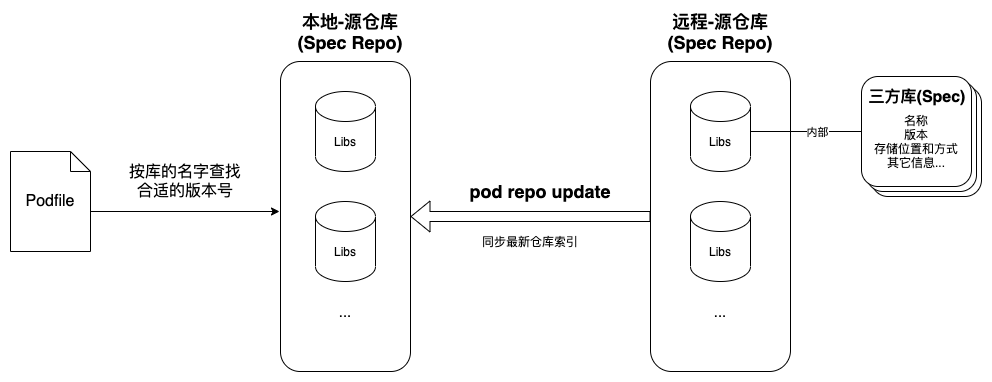

> 老鸟可略过...

### 仓库源

在`Cocoapods` `1.7.2`版本前, 首次安装还需要初始化好几个`GB`的`仓库源`(git方式拉取, 源为`github`), 拉起速度又慢, 而且改非常大。

后来在`1.7.0`提出一个实验性方案, 把`git方式的仓库源`改为`CDN方式的仓库源`, 最后在`1.7.2`正式启用。

- 旧的仓库源: `https://github.com/CocoaPods/Specs.git`
- 新的仓库源: `https://cdn.cocoapods.org/`

### `Cocoapods`相关目录及结构

- `${用户目录}/.cocoapods/repos/${源仓库名称}` # 源仓库
- git源仓库结构
  - `${三方库名称}/${版本号}/${spec文件}`
- CDN源仓库结构(主要结构)
  - `all_pods.txt` 所有库的版本号信息
  - `all_pods_versions_${MD5[0]}_${MD5[1]}_${MD5[2]}.txt` 按`MD5(库名称)[0...3]`切分文件存储库的版本号信息
    - `txt文件`每行一个库, 格式`${库名称}/${版本号}/${版本号}/...`

### `Podfile`&`源仓库`&`三方库`关系图

### `pod update/install`的部分简略流程

1. `本地源仓库`同步`远程源仓库`(**强烈建议**命令后面添加参数`--no-repo-update`略过这步, 有需要同步再手动更新`pod repo update`)
2. 按库的名称在本地源仓库查找合适版本号的`spec`(git和CDN的源查找方式不一样)
3. 根据`spec`中的`source`和其它相关参数下载(`git/svn/hg/http`)仓库文件(这步之前还有个本地缓存查找的过程)

### 库的名字查找`spec`

- git仓库源
  - 根据本地目录结构查找`spec文件`
- CDN仓库源
  1. 三方库的名称进行`MD5(小写)`, 结果取前**3**位字母
  2. 访问对应的本地文件(`all_pods_versions_${MD5[0]}_${MD5[1]}_${MD5[2]}.txt`)查找合适的版本号
  3. 通过链接`https://cdn.cocoapods.org/Specs/${MD5[0]}_${MD5[1]}_${MD5[2]}/${仓库名}/${版本号}/${仓库名}.podspec.json`获取`spec文件`

> `rust`写了个根据`podfile.lock`检测库是否有新版本的小工具, 里面就是利用`CDN仓库源`方式查找版本, 有兴趣可以去看看<https://github.com/skytoup/PodHelper>

### 源仓库管理命令

- `pod repo` # 列出添加的源
- `pod repo add ${源仓库本地名称} ${源仓库链接}` # 添加源
- `pod repo remove ${源仓库本地名称} # 移除源, 也可以直接删除`${用户目录}/.cocoapods/repos/${源仓库名称}`

### 相关链接

- 1.7.2更新说明: <https://blog.cocoapods.org/CocoaPods-1.7.2/>
- podspec.source doc: <https://guides.cocoapods.org/syntax/podspec.html#source>