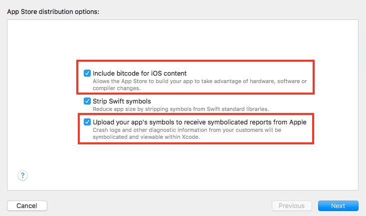

### 简介

操作归档的DWARF调试符号文件

### 场景一

> 打包有开启`bitcode`, 上传时没有勾选上传`符号文件`。
> 结果iTunes后台处理完安装包后, 不会有`下载dSYM文件`, 导致该安装包发生的闪退日志无法还原符号, 只能看到一堆地址。
> 
> 
> 

解决方法

0. 找到对应打包的的`***.xcarchive`归档文件, 点击`右键`选择`查看包内容(Show Package Contents)`, 看到里面有两个符号表相关的文件夹, 分别是`BCSymbbolMaps`和`dSYMs`。
	- 虽然这里有`dSYMs`, 但是是隐藏了部分符号的, 直接使用会导致还原的堆栈信息显示很多`hidden`符号。
1. 打开`终端`并切换当前工作目录到你的`***.xcarchive`(即`cd /....../***.xcarchive`), 再输入命令`dsymutil --symbol-map BCSymbolMaps dSYMs/*`, 即可把`BCSymbolMaps`内的符号信息更新到`dSYMs`目录下的对应文件

### 场景2

> 
> 在开发周期内, 打的一些测试包没有上传符号文件, 后来这个安装包发生闪退的情况, 想还原堆栈时发现该打包的相关文件已经被清理。
> 
> 或者最近看到有些开发者说`bugly`和`UMeng`的线上闪退堆栈无法还原, 而且上传了对应的`dSYM`, 可以先尝试到`iTunes`后台下载对应包`dSYM`上传试试, 还是不行可以往下看试试。
> 

解决方法

0. 获取发生闪退的`ipa`
	- 已上线
		- 打包后归档的文件里面, 有一个`***.ipa`的文件
		- 越狱设备安装该线上包后, 进行脱壳提取
	- 日常开发测试(上传到类似`fir`、`pgyer`的网址)
		- 打包后归档的文件里面, 有一个`***.ipa`的文件
		- 到对应地方下载安装的`***.ipa`
1. 解压`***.ipa`, 对app的主二进制文件(`Payload/***.app/***`)使用`restore-symbol`(<https://github.com/tobefuturer/restore-symbol>)进行部分被裁的符号表还原
	- `restore-symbol`(<https://github.com/tobefuturer/restore-symbol>)的使用请参考该工具, 主要是根据`class-dump`恢复`OC`的对应符号信息更新到到`mach-o`, 也有一些fork分支有实现恢复`swift`的符号还原
2. 终端执行命令`dsymutil {替换为上一步已还原符号的二进制文件路径} -o {替换为dSYMs输出的目录路径}`
	- 例如`dsymutil testBin -o ./dSYMs`

### 参考链接
- dsymutil - man: <https://llvm.org/docs/CommandGuide/dsymutil.html>
- Apple Docs - Restore-Hidden-Symbols: <https://developer.apple.com/documentation/xcode/adding-identifiable-symbol-names-to-a-crash-report#Restore-Hidden-Symbols>
