- 2021年不知道发什么神经, 开始研究`xcassets`文件解析, 用`Python`把`BOM`和`car`的结构初步解析出来. 
- 2025年又开始发神经, 将2021年的`Python`代码用`Rust`重写. 写着写着发神经, 想把`car`的内容提取出来. 被`Deepmap2`解码卡住, 无奈中断. 
- 2026年碰上`AI+Agent`, 想起来这货, 于是拿来练手.

> **本文全部由`Agent`分析代码总结的文件结构、流程.**
>
> 如有审核不足, 可在评论区指出错漏的地方.
> 
> 代码有空整理再放出来吧🕊️🕊️🕊️
# Apple Assets (.car) File Format

Apple 的 `.car` (Compiled Asset Catalog) 文件是 Xcode 在编译 Asset Catalog (`.xcassets`) 时生成的二进制文件。它采用三层嵌套结构：**BOM 容器** 包裹 **CAR 元数据与索引**，CAR 索引指向 **CSI 渲染数据**。

## 整体架构

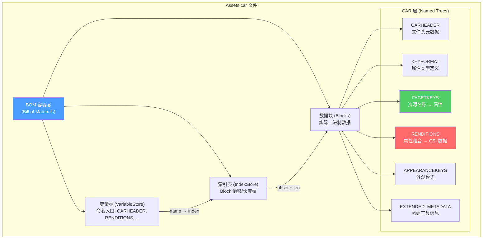

---

## 1. BOM 容器层

BOM (Bill of Materials) 是 Apple 通用的二进制容器格式，`.car` 文件以此为底层封装。**所有 BOM 结构使用大端序 (Big-Endian)**。

### 1.1 文件布局

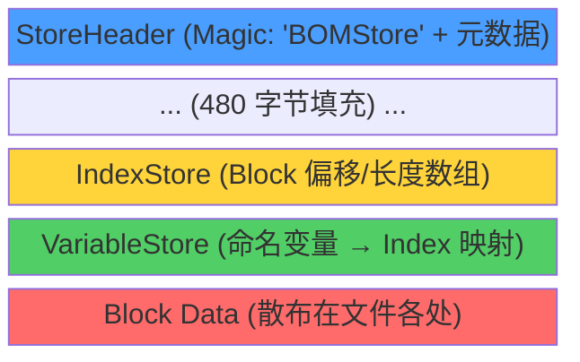

### 1.2 StoreHeader

| 偏移 | 大小 | 字段 | 说明 |
|------|------|------|------|
| 0x00 | 8B | magic | `"BOMStore"` |
| 0x08 | 4B | version | 固定为 `1` |
| 0x0C | 4B | block_count | 非空 Block 数量 |
| 0x10 | 4B | index_offset | IndexStore 的文件偏移 |
| 0x14 | 4B | index_len | IndexStore 长度 |
| 0x18 | 4B | var_offset | VariableStore 的文件偏移 |
| 0x1C | 4B | var_len | VariableStore 长度 |
| 0x20 | 480B | (padding) | 保留填充 |

### 1.3 IndexStore (Block 索引表)

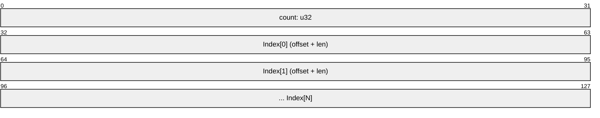

每个 `Index` 条目 (8 字节)：

| 字段 | 大小 | 说明 |
|------|------|------|
| offset | u32 | Block 数据的文件绝对偏移 |
| len | u32 | Block 数据长度 |

### 1.4 VariableStore (命名变量表)

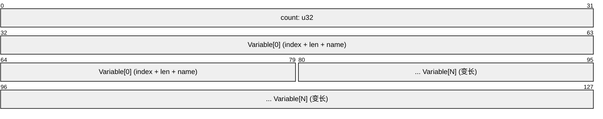

每个 `Variable` (变长)：

| 字段 | 大小 | 说明 |
|------|------|------|
| index | u32 | 指向 IndexStore 的索引 |
| len | u8 | 名称长度 |
| name | [u8; len] | 变量名 (如 `"CARHEADER"`) |

### 1.5 B-Tree 结构

BOM 中的树用于存储键值对集合，CAR 的各命名树均采用此结构。

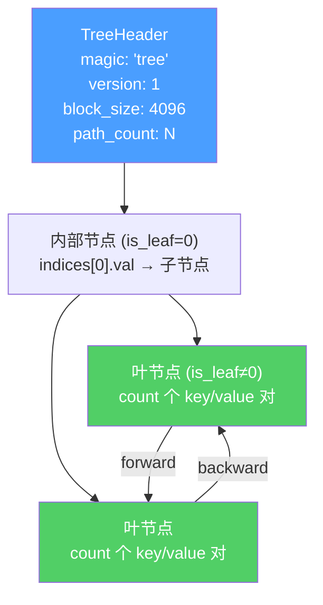

**TreeHeader** (位于命名 Block 中)：

| 字段 | 大小 | 说明 |
|------|------|------|
| magic | 4B | `"tree"` |
| version | u32 | 固定为 `1` |
| index | u32 | 根节点在 IndexStore 中的索引 |
| block_size | u32 | 固定为 `4096` |
| path_count | u32 | 叶节点中的 key/value 对总数 |
| unknown | u8 | 未知 |

**TreePaths** (树节点)：

| 字段 | 大小 | 说明 |
|------|------|------|
| is_leaf | u16 | 0=内部节点, 非0=叶节点 |
| count | u16 | 子项数量 |
| forward | u32 | 下一个兄弟节点的 Block 索引 |
| backward | u32 | 上一个兄弟节点的 Block 索引 |
| indices | [TreePathIndex; count] | key/value 对 |

**TreePathIndex** (每条 8 字节)：

| 字段 | 大小 | 说明 |
|------|------|------|
| val | u32 | value Block 在 IndexStore 中的索引 |
| key | u32 | key Block 在 IndexStore 中的索引 |

### 1.6 寻址流程

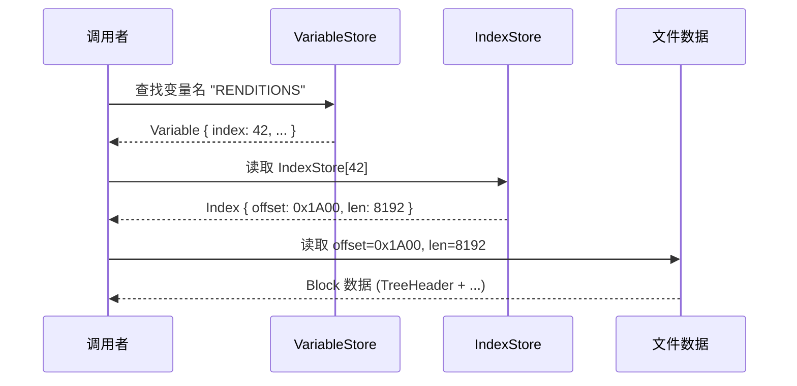

---

## 2. CAR 层 (Asset Catalog)

CAR 层建立在 BOM 容器之上，通过 6 个命名 BOM Tree 组织资源数据。**CAR 层结构使用小端序 (Little-Endian)**（ExtendedMetadata 除外）。

### 2.1 命名树一览

| 树名 | 类型 | 说明 |
|------|------|------|
| `KEYFORMAT` | 单值 | 属性类型定义 (KeyFmt) |
| `CARHEADER` | 单值 | 文件头元数据 (Header) |
| `EXTENDED_METADATA` | 单值 | 构建工具信息 (大端序) |
| `APPEARANCEKEYS` | 键值树 | 外观模式映射 |
| `FACETKEYS` | 键值树 | 资源名称 → 属性 Token |
| `RENDITIONS` | 键值树 | 属性组合 → CSI 渲染数据 |

### 2.2 解析流程


### 2.3 CARHEADER (文件头)

Magic: `"RATC"` (小端序)

| 字段 | 类型 | 说明 |
|------|------|------|
| coreui_version | u32 | CoreUI 版本 |
| storage_version | u32 | 存储格式版本 |
| storage_timestamp | u32 | 存储时间戳 |
| rendition_count | u32 | 渲染项总数 |
| main_version_string | String(128B) | 主版本字符串 |
| version_string | String(256B) | 版本字符串 |
| uuid | [u8; 16] | 唯一标识符 |
| associated_checksum | u32 | 关联校验和 |
| schema_version | u32 | Schema 版本 |
| color_space | ColorSpace | 默认色彩空间 |
| key_semantics | u32 | 键语义 |

### 2.4 KEYFORMAT (键格式)

Magic: `"tmfk"` (小端序)

KeyFmt 定义了 RENDITIONS 树中键的属性类型序列，决定了每个渲染项的键如何被解析。

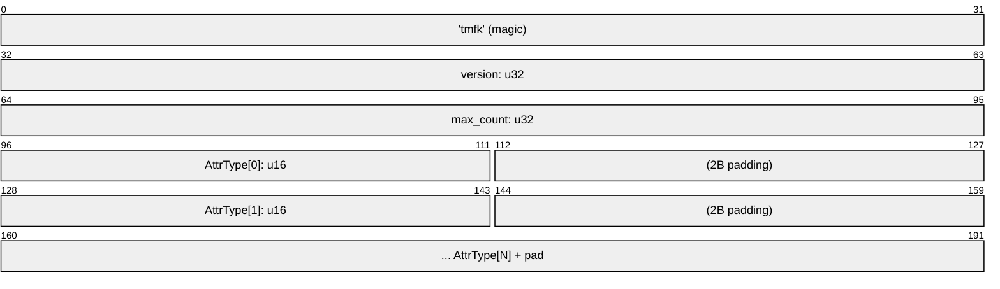

**AttributeType 枚举** (u16)：

| 值 | 名称 | 说明 |
|----|------|------|
| 0 | ThemeLook | 主题外观 |
| 1 | Element | UI 元素类型 |
| 2 | Part | 部件 |
| 3 | Size | 尺寸类别 |
| 4 | Direction | 布局方向 |
| 6 | Value | 值 |
| 7 | ThemeAppearance | 主题外观模式 |
| 8-9 | Dimension1/2 | 维度 |
| 10 | State | 状态 |
| 11 | Layer | 图层 |
| 12 | Scale | 缩放比例 (@1x/@2x/@3x) |
| 13 | Localization | 本地化 |
| 15 | Idiom | 设备类型 |
| 16 | Subtype | 子类型 |
| **17** | **Identifier** | **资源标识符 (用于索引渲染数据库)** |
| 20-21 | H/V SizeClass | 水平/垂直尺寸类别 |
| 24 | DisplayGamut | 显示色域 |
| 25 | DeploymentTarget | 部署目标 |

### 2.5 FACETKEYS (资源名称索引)

FACETKEYS 是一个 `HashMap<String, KeyToken>` 的树，将资源名称映射到属性集合。

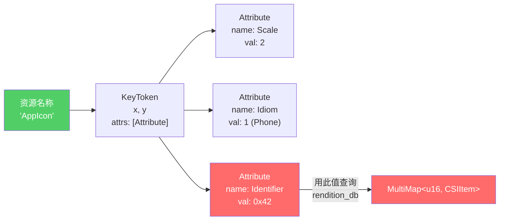

### 2.6 RENDITIONS 树键值结构

RENDITIONS 树是 `.car` 文件的核心数据存储。

**键结构**：按 KEYFORMAT 定义的属性类型序列，每个属性值为 u16 (小端序)。

```
Key: [ThemeLook:u16][Element:u16][Part:u16]...[Identifier:u16]...
     ← 按 KEYFORMAT 中的顺序排列 →
```

**值结构**：CSIHeader + TLV 元数据 + 可选渲染数据 (详见第 3 节)。

**查找流程**：

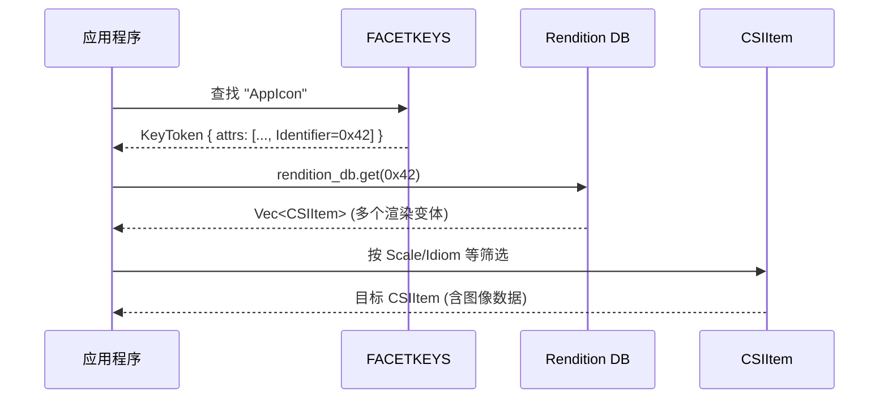

### 2.7 EXTENDED_METADATA

Magic: `"META"` (**大端序** - 唯一的大端序 CAR 结构)

| 字段 | 大小 | 说明 |
|------|------|------|
| thinning_args | 256B | Thinning 参数 |
| deployment_platform_version | 256B | 部署平台版本 |
| deployment_platform | 256B | 部署平台 |
| authoring_tool | 256B | 构建工具信息 |

---

## 3. CSI 层 (Core Structured Image)

CSI 是单个渲染项的完整数据结构，包含元数据、TLV 扩展信息和实际渲染数据。

### 3.1 CSIHeader 布局

Magic: `"ISTC"` (小端序)

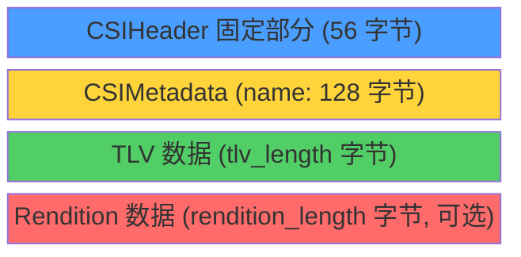

**固定部分**：

| 字段 | 类型 | 说明 |
|------|------|------|
| magic | [u8; 4] | `"ISTC"` |
| version | u32 | CSI 版本 |
| flags | Flags | 位域标志 (32位) |
| width | u32 | 图像宽度 |
| height | u32 | 图像高度 |
| scale_factor | u32 | 缩放因子 (100=@1x, 200=@2x, 300=@3x) |
| encoding | Encoding | 像素编码格式 |
| color_model | ColorModel | 色彩模型 |

**CSIMetadata**：

| 字段 | 类型 | 说明 |
|------|------|------|
| modification_time | u32 | 修改时间 |
| layout_type | LayoutType | 布局类型 |
| name | String(128B) | 渲染项名称 |

**BitmapList** (紧跟 CSIMetadata 之后)：

| 字段 | 类型 | 说明 |
|------|------|------|
| bitmap_count | u32 | 位图数量 (通常为 1) |
| zero | u32 | 保留 (通常为 0) |
| rendition_length | u32 | Rendition 数据长度 |

### 3.2 Flags 位域

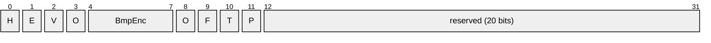

> H=is_header_flagged_fpo, E=is_excluded_from_contrast_filter, V=is_vector_based, O=is_opaque, BmpEnc=bitmap_encoding(4bit), O=opt_out_of_thinning, F=is_flippable, T=is_tintable, P=preserved_vector_representation

| 位 | 标志 | 说明 |
|----|------|------|
| 0 | is_header_flagged_fpo | FPO 标记 |
| 1 | is_excluded_from_contrast_filter | 排除对比度滤镜 |
| 2 | is_vector_based | 矢量图 |
| 3 | is_opaque | 不透明 |
| 4-7 | bitmap_encoding | 位图编码子类型 |
| 8 | opt_out_of_thinning | 不参与 Thinning |
| 9 | is_flippable | 可翻转 |
| 10 | is_tintable | 可着色 |
| 11 | preserved_vector_representation | 保留矢量表示 |
| 12-31 | reserved | 保留位 |

### 3.3 Encoding (像素编码)

| Tag (4字节) | 枚举值 | 说明 |
|-------------|--------|------|
| `\0\0\0\0` | None | 无像素数据 |
| `BGRA` | ARGB | BGRA 字节序 → RGBA (交换 R/B) |
| `ATAD` | Data | 原始数据 |
| `YARG` | GRAY | 灰度 8位 |
| `GEPJ` | JPEG | JPEG 压缩 |
| `_FDP` | PDF | PDF 矢量 |
| `PBEW` | WEBP | WebP 压缩 |
| `WBGR` | ARGB16 | 16位 BGRA |
| `61AG` | GA16 | 灰度+Alpha 16位 |
| `_8AG` | GA8 | 灰度+Alpha 8位 |
| `5BGR` | RGB5 | XRGB1555 格式 |
| `_GVS` | SVG | SVG 矢量 |
| `FIEH` | HEIF | HEIF 压缩 |

### 3.4 ColorModel / ColorSpace

**ColorModel** (u32)：

| 值 | 名称 | 说明 |
|----|------|------|
| 0 | None | 无 |
| 1 | RGB | RGB |
| 2 | Monochrome | 单色 |
| 3 | RGB0 | RGB (变体) |
| 4 | RGBP3 | Display P3 |

**ColorSpace** (u32)：

| 值 | 名称 |
|----|------|
| 1 | sRGB |
| 2 | GrayGamma2.2 |
| 3 | Display P3 |
| 4 | Extended Range sRGB |
| 5 | Extended Linear sRGB |
| 6 | Extended Gray |
| 257 | System sRGB |

### 3.5 TLV 元数据 (RenditionType)

TLV (Tag-Length-Value) 格式存储附加元数据，紧跟在 BitmapList 之后。

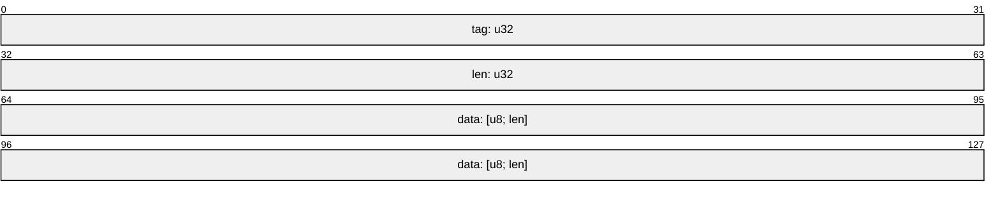

> 以上为单个 TLV 条目，CSI 中连续存放 N 个 TLV。

| Tag | 名称 | 数据内容 |
|-----|------|---------|
| 1001 | Slices | 九宫格切片信息 (x, y, w, h) × N |
| 1003 | Metrics | 上右内边距 + 下左内边距 + 图像尺寸 |
| 1004 | BlendModeAndOpacity | blend_mode: u32 + opacity: f32 |
| 1005 | UTI | 统一类型标识符 (如 `"public.png"`) |
| 1006 | EXIFOrientation | EXIF 旋转方向 (0-8) |
| 1007 | BytesPerRow | 行字节步长 (stride) |
| 1010 | Reference | 内部引用 (magic `"INLK"` + 坐标 + 键) |

### 3.6 Rendition 数据类型

Rendition 是 CSI 中的实际载荷数据，按 magic 标识区分类型：

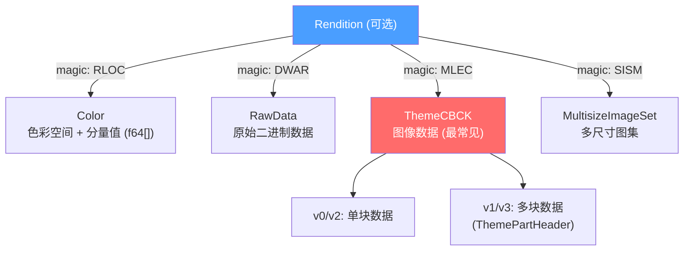

**RenditionColor** (`RLOC`)：

| 字段 | 类型 | 说明 |
|------|------|------|
| version | u32 | 版本 |
| color_space | ColorSpace | 色彩空间 |
| components | Vec\<f64\> | 颜色分量 |

**RenditionThemeCBCK** (`MLEC` - 最常见)：

| 字段 | 类型 | 说明 |
|------|------|------|
| version | u32 | 版本 (0-3) |
| compression_type | CompressionType | 压缩类型 |
| raw_datas | Vec\<Vec\<u8\>\> | 压缩数据块 |

### 3.7 CompressionType

| 值 | 名称 | 说明 |
|----|------|------|
| 0 | Uncompressed | 未压缩 |
| 1 | Rle | 行程编码 |
| 2 | Zip | Zip 压缩 |
| 3 | Lzvn | LZVN 压缩 |
| 4 | Lzfse | LZFSE 压缩 |
| 5 | JpegLzfse | JPEG + LZFSE |
| 6 | Blurred | 模糊处理 |
| 7 | Astc | ASTC 纹理压缩 |
| 8 | PaletteImg | 调色板图像 |
| 9 | HEVC | HEVC 视频帧 |
| 10 | DeepmapLzfse | Deepmap + LZFSE |
| **11** | **Deepmap2** | **Deepmap2 格式 (见第 4 节)** |

### 3.8 LayoutType

布局类型决定了渲染项的用途和展示方式：

| 范围 | 类别 | 示例 |
|------|------|------|
| 6-9 | 特效 | Gradient(6), Effect(7), Vector(9) |
| 10-12 | 单部件 | FixedSize(10), Tile(11), Scale(12) |
| 20-25 | 三段式 | H-Tile(20), H-Scale(21), V-Tile(23) |
| 30-34 | 九宫格 | Tile(30), Scale(31), EdgesOnly(34) |
| 40 | 六段式 | SixPart |
| 50 | 动画 | AnimationFilmstrip |
| 1000-1014 | 语义类型 | Data, ExternalLink, Color, Texture... |

### 3.9 Idiom (设备类型)

| 值 | 名称 |
|----|------|
| 0 | Universal |
| 1 | Phone (iPhone) |
| 2 | Pad (iPad) |
| 3 | TV (Apple TV) |
| 4 | Car (CarPlay) |
| 5 | Watch (Apple Watch) |
| 6 | Marketing |

---

## 4. Deepmap2 图像编码

Deepmap2 是 Apple 的专有图像编码格式，支持 4 种解码模式：原始像素、有损预测压缩 (YCoCg)、无损压缩和调色板索引。

### 4.1 Deepmap2Header

Magic: `"dmp2"` (小端序)

| 偏移 | 大小 | 字段 | 说明 |
|------|------|------|------|
| 0x00 | 4B | magic | `"dmp2"` |
| 0x04 | 1B | decode_type | 解码类型 (1-4) |
| 0x05 | 1B | version | 色度缩放标志 |
| 0x06 | 1B | predictor_type | 辅助标志 |
| 0x07 | 1B | pixel_format | 像素格式 (1-4) |
| 0x08 | 2B | width | 图像宽度 |
| 0x0A | 2B | height | 图像高度 |
| 0x0C | 2B | palette_size | 调色板条目数 (仅 Palette 类型) |
| 0x0E | 2B | palette_type | 调色板类型 (仅 Palette 类型) |
| 0x10 | N×4B | palette | 调色板数据 BGRA (仅 Palette 类型) |

**DecodeType**：

| 值 | 名称 | 说明 |
|----|------|------|
| 1 | None | 原始未压缩像素 |
| 2 | Default | LZFSE + Zigzag + 预测 + YCoCg |
| 3 | Lossless | LZFSE 压缩 (无预测) |
| 4 | Palette | 调色板索引 |

**PixelFormat**：

| 值 | 名称 | 每像素字节 | 说明 |
|----|------|-----------|------|
| 1 | G8 | 1 | 灰度 |
| 2 | GA88 | 2 | 灰度 + Alpha |
| 3 | Rgb888 | 3 | RGB |
| 4 | Rgba8888 | 4 | RGBA |

### 4.2 解码流程总览

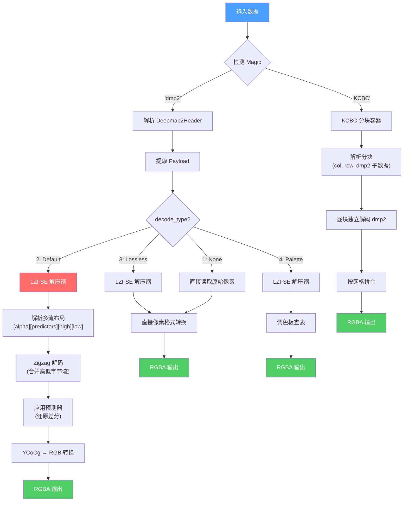

### 4.3 Default 解码 (Type 2) 详解

这是最复杂的解码路径，使用 LZFSE 压缩 + 多流分离 + Zigzag 编码 + 空间预测 + YCoCg 色彩模型。

#### 4.3.1 LZFSE 解压后的内存布局

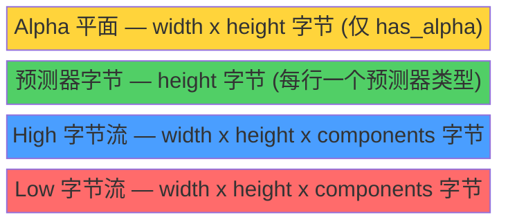

其中 `components` = 3 (彩色, YCoCg 三通道) 或 1 (灰度)。

#### 4.3.2 Zigzag 解码

将分离的高低字节流合并为有符号 16 位值：

```
combined = (lo as u16) | ((hi as u16) << 8)
magnitude = combined >> 1
value = if (combined & 1) != 0 { -magnitude } else { magnitude }
```

#### 4.3.3 预测器算法

每行可独立选择预测器，有 5 种类型：

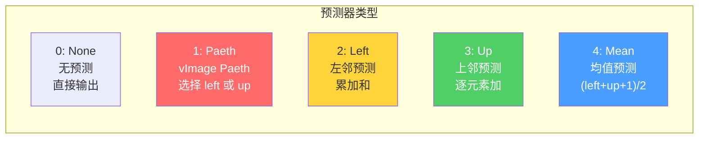

所有预测器以 3 个分量为一组 (PREDICTOR_GROUP_SIZE=3) 进行处理，对应 YCoCg 的 Y、Co、Cg 三通道。

**Paeth 预测器** (简化版)：
```
对每组 3 个分量:
  dist_left = |up[0] - up_left[0]|
  dist_up   = |left[0] - up_left[0]|
  若 dist_left <= dist_up: 整组使用 left
  否则: 整组使用 up
```

#### 4.3.4 YCoCg → RGB 转换

```
co_scaled = Co << chroma_scale
cg_scaled = Cg << chroma_scale
temp = Y - trunc_div2(cg_scaled)

R = clamp(temp + co_scaled - trunc_div2(co_scaled), 0, 255)
G = clamp(temp + cg_scaled, 0, 255)
B = clamp(temp - trunc_div2(co_scaled), 0, 255)
```

其中 `chroma_scale` = 1 (header.version ≠ 0) 或 0。

### 4.4 Palette 解码 (Type 4)

调色板模式使用索引查表，支持两种子类型：

| palette_type | 说明 | Payload 布局 |
|-------------|------|-------------|
| 3 | Alpha + 索引 | `[alpha × pixel_count][index × pixel_count]` |
| 4 | 仅索引 | `[index × pixel_count]` |

调色板条目格式：u32 LE BGRA → 转换为 RGBA 输出。

### 4.5 KCBC 分块容器

大图像可使用 KCBC 容器将图像分块存储，每块独立编码。

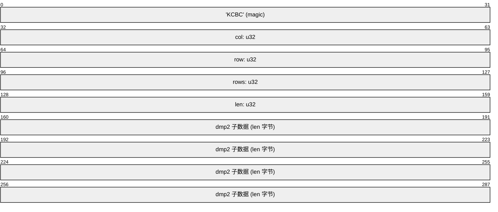

> 以上为单个 KCBC Block，文件中连续存放多个 Block。

解码后按 (row, col) 网格拼合为完整图像。

---

## 5. 端到端数据流

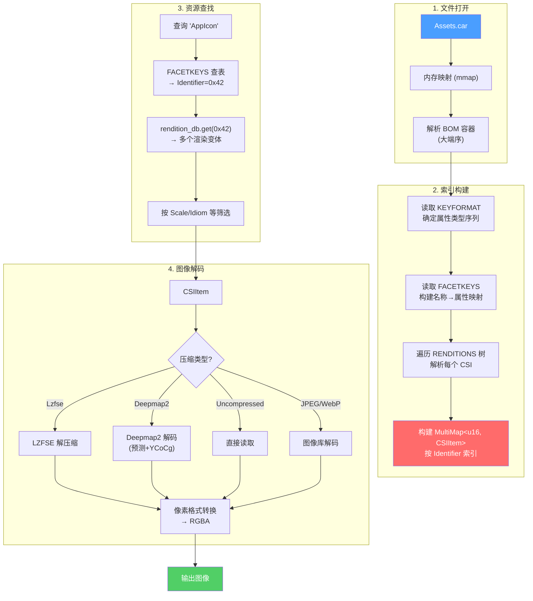

---

## 6. Magic 字节汇总

| Magic | 字节序 | 层级 | 说明 |
|-------|--------|------|------|
| `BOMStore` | - | BOM | 文件头标识 |
| `tree` | - | BOM | B-Tree 头标识 |
| `RATC` | LE | CAR | CARHEADER |
| `ISTC` | LE | CAR | CSIHeader |
| `tmfk` | LE | CAR | KeyFmt |
| `META` | **BE** | CAR | ExtendedMetadata |
| `RLOC` | LE | Rendition | Color 类型 |
| `DWAR` | LE | Rendition | RawData 类型 |
| `MLEC` | LE | Rendition | ThemeCBCK 类型 |
| `SISM` | LE | Rendition | MultisizeImageSet |
| `INLK` | LE | TLV | Reference 引用 |
| `dmp2` | LE | Deepmap2 | Deepmap2 图像头 |
| `KCBC` | LE | Deepmap2 | 分块容器头 |

## 7. 字节序规则

| 层级 | 字节序 | 例外 |
|------|--------|------|
| BOM 容器 | **大端序** | 无 |
| CAR 结构 | **小端序** | ExtendedMetadata (`META`) 使用大端序 |
| CSI / Rendition | **小端序** | 无 |
| Deepmap2 | **小端序** | 无 |
## 参考链接
- [Reverse engineering the .car file format (compiled Asset Catalogs)](https://blog.timac.org/2018/1018-reverse-engineering-the-car-file-format/)
- [A Deep Dive into Apple's .car File Format](https://dbg.re/posts/car-file-format/)
- [vaguilar/carutil](https://github.com/vaguilar/carutil)
- [facebookarchive/xcbuild](https://github.com/facebookarchive/xcbuild)
- [iineva/bom](https://github.com/iineva/bom)
